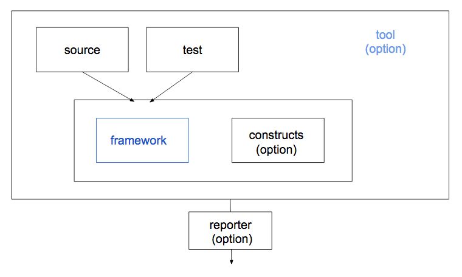
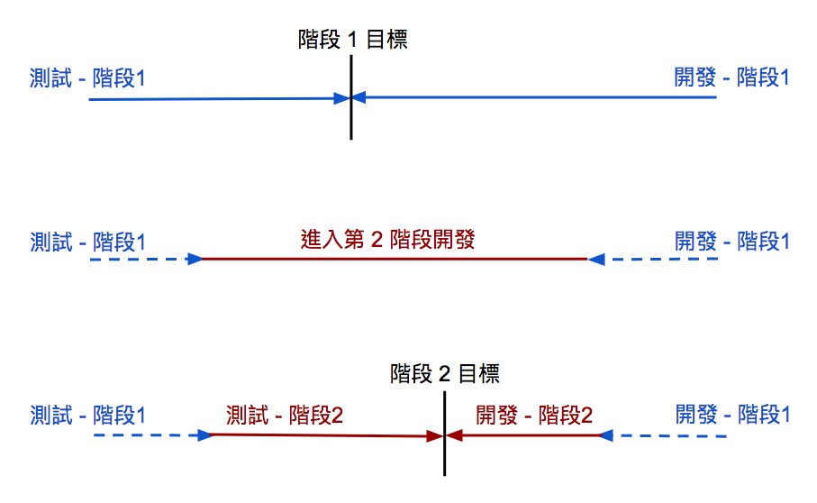
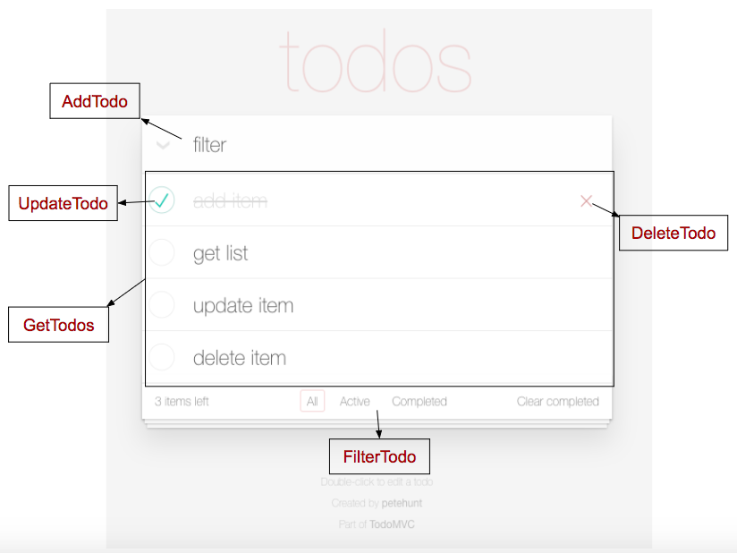
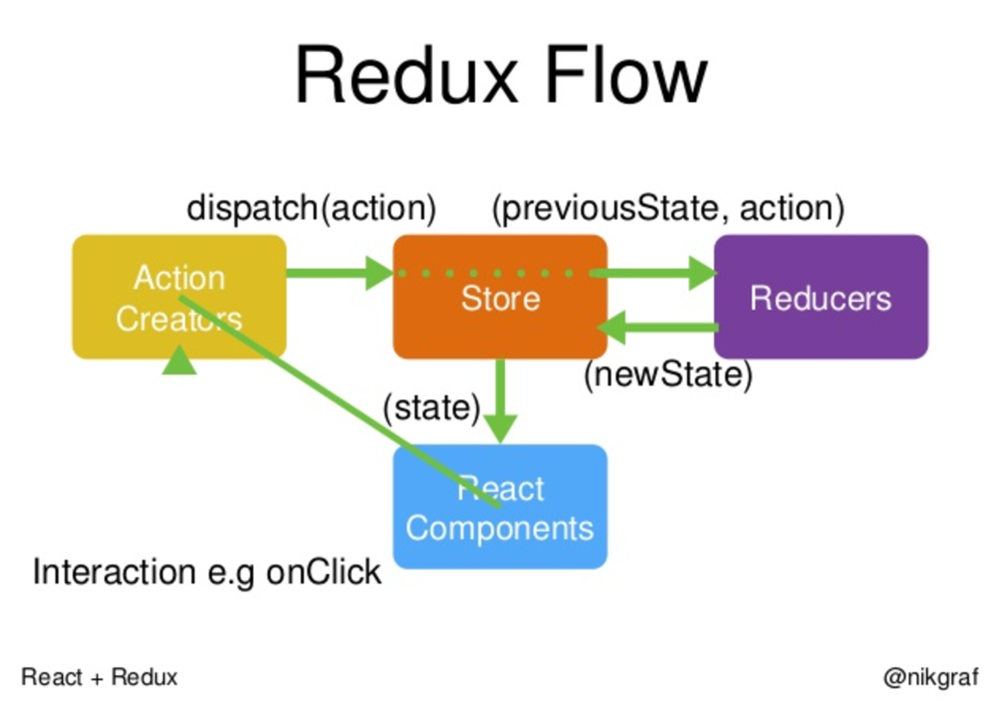
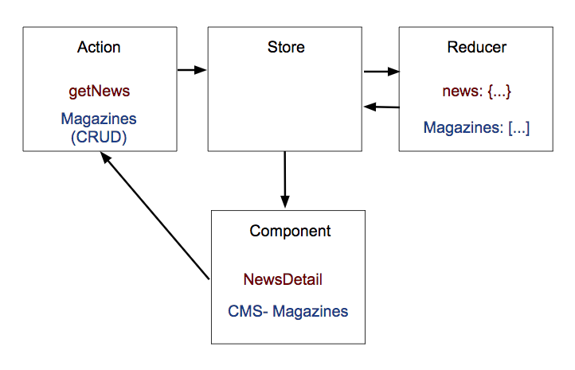

<!-- _class: cover-slide -->
# JS Unit Test
### ichi

---

## Agenda

* Introduction

* How to write unit test

---

<!-- _class: cover-slide -->
# Introduction

---

## Why test

* 大家都說好、很酷

* 安全感

* 服務更穩定，錯誤率降低

---

## 遭遇問題

* 不知道測試該怎麼寫

* 維護麻煩

* 開發時間變長

* 還是有不預期的錯誤發生

---

## 測試的漏洞

* 規劃的條件有遺漏

* 第三方套件有問題

* 瀏覽器有問題

* 測試用的資料有限

---

```js code=codes/add3.js
function add3(num) {
  return num + 3;
}
```

---

## 規劃漏洞

* num 的型別一定是數字嗎

* num 是否有條件限制


## 第三方有問題

* 只能相信用到的 framework、plugin、polyfill 正確

* api，也只能相信資料正確

---

## 瀏覽器

* 這麼多人用一定不會有問題？


## 測試的資料有限

* 數字
  * [Number.MAX_SAFE_INTEGER](https://tc39.github.io/ecma262/#sec-ecmascript-language-types-number-type)
  * [Number.MIN_SAFE_INTEGER](https://tc39.github.io/ecma262/#sec-number.min_safe_integer)

* 字串
  * 跳脫字元
  * 保留字？

---

## 優點

* 可確保寫過的情境要有某種程度的把握

* 盡可能得提早發現問題

* code review

* doc
  * 測試是流暢的前提下
  * 可以看出功能的各種情境、資料流...

---

<!-- _class: cover-slide -->
# About Test

---

## 測試包含

* lint

* unit test

* e2e test

---

## Structure



---

## 工具說明

* framework: jasmine, mocha, qunit...

* constructs: phantomjs, browser deriver (chrome-driver, safari-deriver...), headless...

* tool: jest, karma, chai, zuul, testem...

---

## TDD or BDD

* TDD: test driven develope, 由測試驅動開發

* BDD: behavior driven develope, 先開發後測試

---



---

## unit test vs. e2e test

* unit test
  * 白箱測試
  * 完整的測試每個 function
  * terminal

* e2e test
  * 黑箱測試
  * 模擬互動行為
  * user story
  * browser

---

## How to write

### Goal

|            | value | condition  |
|------------|-------|------------|
| toBe       |  F/T  |    F/T     |
| toContain  |  F/T  |    F/T     |


* expect function(value) toBe expected

* expect function(value) not toBe expected

---

## Flow

* 小 -> 大

* 沒有畫面 -> 有畫面

* 跟事件無關 -> 事件測試

---

## 寫測試的心態

* 對照的功能寫的測試根本就是渣

* 先功能、後測試
  * 這功能一定哪裡有問題
  * 這條件一定哪裡有錯
  * 各種吹毛求疵就對了

* 先測試、後功能
  * 再想一次、預計的流程是不是對的
  * 想盡辦法、也要把功能寫得跟預計結果一樣

---

## Example

### [todomvc](http://todomvc.com/examples/react/#/) as an example



---

## AddTodo as an example

```js code=codes/addTodo.js
// action
const todoList = [];
function addTodo(item) { todoList.push(item); }

// component
class AddTodo extends Component {
  onSubmit = () => {
    addTodo(...);
  };

  render() {
    return (
      <form onSubmit={this.onSubmit}>
        <input />
        <button type="submit" />
      </form>
    );
  }
};
```

<!-- speaker comment
  @[1-3](action)
  @[5-19](component)
-->

---

## test AddTodoAction

```js code=codes/testAddAct1.js
// action
const todoList = [];
function addTodo(item) { todoList.push(item); }
function getTodoList() { return todoList; }

// test
//expect(addTodo(fakeItem)).?
addTodo('fakeItem');
expect(getTodoList()).toContain('fakeItem');
```

<!-- speaker comment
  @[1-3](action addTodo)
  @[6-7](發現不好測試)
  @[4](加入 getTodoList)
  @[8-9](利用 getTodoList 協助測試)
  @[8](輸入的值，一定是有意義的嗎？)
-->

---

```js code=codes/testAddAct2.js
function addTodo(item = '') {
  if (item.length) { todoList.push(item); }
}

// test
addTodo('fakeItem');
expect(getTodoList()).toContain('fakeItem');
addTodo();
expect(getTodoList().length).toBe(1);
```

<!-- speaker comment
  @[1-3](經過修正)
  @[5-7](原來的測試)
  @[8-9](後來新增的測試)
-->

---

## test AddTodo

```js code=codes/testAddComp1.js
// component
class AddTodo extends Component {
  state = { submitted: false };

  onSubmit = () => {
    addTodo(this.newItem.value);
    this.setState({ submitted: true });
  };

  render() {
    return (
      <form onSubmit={this.onSubmit}>
        <input ref={ref = this.newItem = ref} />
        <button type="submit" />
      </form>
    );
  }
};
```

---

### 檢查畫面

```js
// test content
const wrapper = mount(<AddTodo />);
expect(wrapper).toContain('form');
expect(wrapper).toContain('input');
expect(wrapper).toContain('button');
// snapshot?
expect(wrapper.toJson()).toMatchSnapshot();
```
<!-- speaker comment
  @(畫面組成測試)
  @(可以用 snapshot 嗎？)
-->

---

### 檢查事件

test event 的方案 1, 2, 3 該選哪個？

```js
// test event
const wrapper = mount(<AddTodo />);
expect(wrapper.state().submiited).toBe(false);
wrapper.find('form').simulate('submit');
// 方案 1
// after simulate
const list = getTodoList();
expect(list).toContain(...);
// 方案 2
addTodo = jest.fn(); // mock function
// after simulate
expect(addTodo).toBeCalled();

// add onSubmit test
expect(wrapper.state().submitted).toBe(false);
wrapper.onSubmit();
expect(addTodo).toBeCalled();
expect(wrapper.state().submitted).toBe(true);

// 方案 3
wrapper.onSubmit = jest.fn(); // mock function
// after simulate
expect(wrapper.onSubmit).toBeCalled();
```

<!-- speaker comment
  @(模擬事件，可能要先確定初始狀態，如 submitted ..等)
  @(利用 getTodoList() 輔助)
  @(mock action addTodo)
  @(從源頭 mock onSubmit)
  @(在 mock onSubmit，必須確保 onSubmit 正確)
-->

---

## 比較方案

|   | 優點                 | 缺點                     |
|---|----------------------|--------------------------|
| 1 | 真的很詳細           | 仔細到有點煩             |
| 2 | 不需要在意外來的     | 自身的行為和功能無法脫勾 |
| 3 | 自身的行為和功能脫鉤 | 測試寫起來有點多         |

---

## 引用元件

```js code=codes/testAddComp3.js
// component App
function App() {
  return (
    <div>
      <AddTodo />
    </div>
  );
}

// test
const wrapper = mount(<App />);
expect(wrapper).toContain('AddTodo');
```

<!-- speaker comment
  @[1-8](定義 App)
  @[10-12](只需要測試是否包含子元件)
-->

---

## How to maintain

* 安插新進測試到合適的位置
  * 不會總是加在最後

* 檢查是否有過時或重複的測試

---

AddTodo 有新需求處理

* 最多 10 個 todo

* 新增顯示 error 訊息

---

## 新增的條件

```js code=codes/testAddTodo2.js
// action
const todoList = [];
function addTodo(item = '') {
  if (item.length && todoList.length < 11) {
    todoList.push(item);
  }
}
function getTodoList { return todoList; }

// test action
addTodo('fakeItem');
expect(getTodoList()).toContain('fakeItem');
addTodo();
expect(getTodoList().length).toBe(1);

// limit 10
(new Array(10)).forEach((val, idx) => addTodo(`fakeItem${idx}`));
expect(getTodoList().length).toBe(10);
addTodo('fakeItem11');
expect(getTodoList).not.toContain('fakeItem11');
```
<!-- speaker comment
  @[4](加上最多 10 個的條件)
  @[16-20](必須補上條件的測試)
-->

---

## 調整顯示訊息

### 程式

```js code=codes/testAddTodo2.js
// component
class AddTodo extends Component {
  ...
  render() {
    ...
    return (
      <form onSubmit={this.onSubmit}>
        {message.length &&
          <div className="alert">{message}</div>
        }
        ...
      </form>
    );
  }
};
```

---

### 測試

```js
// test content
const wrapper = mount(<AddTodo />);
expect(wrapper).toContain('form');
expect(wrapper).toContain('input');
expect(wrapper).toContain('button');

// test message block
// message == ''
expect(wrapper.state().message.length).toBe(0);
expect(wrapper).not.toContain('div.alert');
// message !== ''
wrapper.setState({ message: 'Something error' });
expect(wrapper.state().message.length).not.toBe(0);
expect(wrapper).toContain('div.alert');
```

<!-- speaker comment
  @[45-47](加上訊息區塊)
  @[61](畫面必須補上訊息顯示的測試)
  @[62-64](沒有訊息)
  @[65-68](有訊息)
  @[29-37](設置並更新訊息的時機)
  @[78-84](方案 1，設置真的 todoList)
  @[84-90](方案 2，mock getTodoList)
  @[94-99](採取 test event 方案 3 ，原來 form onSubmit 的地方不需要修改)
  @[92](state.submitted 沒有用到？需要還是不需要？)
-->

---

## 調整行為

### 程式

```js
// component
class AddTodo extends Component {
  ...
  onSubmit = () => {
    const todoList = getTodoList();

    if (todoList.length < 11) {
      addTodo(this.newItem.value);
      this.setState({ submitted: true });
    } else {
      this.setState({ message: 'Something error' });
    }
  };
  ...
};
```

---

### 測試

```js
// submit with limit todoList
// limit todoList 方案 1
(new Array(10)).forEach((val, idx) => addTodo(`fakeItem${idx}`));
addTodo = jest.fn();
expect(getTodoList().length).toBe(10);
wrapper.onSubmit();
expect(addTodo).not.toBeCalled();

// limit todoList 方案 2
getTodoList = jest.fn().mockReturnValue(new Array(10)); // mock getTodoList
expect(getTodoList().length).toBe(10);
wrapper.onSubmit();
expect(addTodo).not.toBeCalled();

// submitted is not used?

// test event 方案 3
const wrapper = mount(<AddTodo />);
expect(wrapper.state().submitted).toBe(false);
wrapper.find('form').simulate('submit');
wrapper.onSubmit = jest.fn(); // mock function
expect(wrapper.onSubmit).toBeCalled();
```

<!-- speaker comment
  @[29-37](設置並更新訊息的時機)
  @[78-84](方案 1，設置真的 todoList)
  @[84-90](方案 2，mock getTodoList)
  @[94-99](採取 test event 方案 3 ，原來 form onSubmit 的地方不需要修改)
  @[92](state.submitted 沒有用到？需要還是不需要？)
-->

---

## 維護測試很麻煩

* 每次更新程式都要改測試嗎？不一定

* 依照順序時，維護起來就輕鬆很多

---

## Something Hard

* Key event

* All about browser
  * scroll
  * size, viewport
  * redirect

* Timer
  * timeout, intervel

* Request

---

## key event

* 當實作鍵盤的事件，通常代表功能複雜

* 採取 test event 方案 3
  - 單獨對 event function 測試
  - 再模擬事件

---

## scroll event, size, viewport

* 不會有完整 dom 屬性或方法

* 採取 test event 方案 3
  - 可能需要先設定一些假資料，如：document.clientHeight...
  - 單獨對 event function 測試

---

## redirect

測試不能 redirect

```js code=codes/testRedirect.js
// 方案 1
function redirect(dest) {
  window.location.href = dest;
}

function clickAbout() {
  redirect('/about');
}

// test 方案1
redirect = jest.fn(); // mock function
clickAbout();
expect(redirect).toBeCalledWith('/about');

// 方案 2
function redirect(location, dest) {
  location.href = dest;
}

function clickAbout(location) {
  redirect(location, '/about');
}

// test 方案 2
let location = {};
clickAbout(location);
expect(location.href).toBe('/about');
```

<!-- speaker comment
  @[1-14](方案 1)
  @[15-27](方案 2)
-->

---

## Timeout, Intervel

* 一般透過 framework 的 clock mock
  * [jasmine mock timeout function](https://jasmine.github.io/2.0/introduction.html#section-Mocking_the_JavaScript_Timeout_Functions)
  * [jest timer-mock](https://facebook.github.io/jest/docs/en/timer-mocks.html)

---

## Request

* 也是透過各種 mock
  * [jasmine ajax mock](https://jasmine.github.io/2.0/ajax.html)
  * [nock - HTTP mocking and expectations library](https://github.com/node-nock/nock)
 
* 原理
  * mock function and response
  * mock request

---

## Ongoing Project



[ref](https://www.slideshare.net/nikgraf/react-redux-introduction)

---



* 確保更新資料正確 -> reducer
* 確保操作正確 -> action
* 確保顯示正確 -> component

---

<!-- _class: cover-slide -->
# FIN
